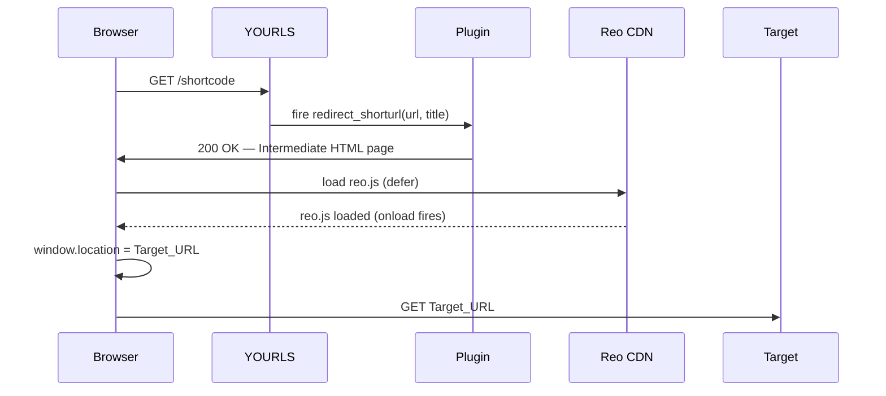

# Design Document: yourls-reo-tracking

## Overview

The `yourls-reo-tracking` plugin is a single-file YOURLS plugin that intercepts every short URL redirect and serves a lightweight HTML intermediate page. That page loads the Reo.dev tracking snippet, waits for the `onload` callback to fire (giving Reo time to identify the visitor), then navigates the browser to the original Target_URL. A `<meta http-equiv="refresh">` tag provides a no-JS fallback.

The plugin has no database schema, no admin UI, and no external dependencies beyond the YOURLS plugin API. Activation and deactivation are handled entirely through YOURLS hook registration.

### Key Design Decisions

- **Single PHP file** — keeps installation trivial (drop folder, activate).
- **Hook: `redirect_shorturl`** — fires before YOURLS sends the `Location` header, giving us the Target_URL and the ability to suppress the default redirect.
- **`die()` after output** — the standard YOURLS pattern for suppressing the default response after a plugin takes over.
- **`htmlspecialchars()` + `json_encode()`** — two separate escaping contexts (HTML attribute and JS string literal) are handled independently to prevent XSS.

---

## Architecture



The plugin registers one action hook. When YOURLS fires `redirect_shorturl`, the plugin callback:

1. Validates the Target_URL (400 if invalid).
2. Escapes the URL for both HTML and JS contexts.
3. Outputs the Intermediate_Page HTML.
4. Calls `die()` to suppress the default YOURLS redirect.

---

## Components and Interfaces

### plugin.php (main plugin file)

Located at `user/plugins/yourls-reo-tracking/plugin.php`.

**YOURLS plugin header** (required comment block):

```php
/*
Plugin Name:  Reo Tracking
Plugin URI:   https://github.com/your-org/yourls-reo-tracking
Description:  Injects Reo.dev analytics on every short URL redirect via an intermediate page.
Version:      1.0
Author:       Your Name
Author URI:   https://yourorg.com
*/
```

**Hook registration** (runs at file load time, outside any function):

```php
yourls_add_action('redirect_shorturl', 'reotracking_intercept');
```

**Callback signature**:

```php
function reotracking_intercept(string $url, string $title): void
```

YOURLS passes the Target_URL as the first argument and the short URL title as the second. The function:

- Validates `$url` (non-empty string → else `status_header(400); die()`).
- Escapes `$url` with `htmlspecialchars($url, ENT_QUOTES, 'UTF-8')` for HTML contexts.
- Escapes `$url` with `json_encode($url)` for the JS string literal.
- Outputs the Intermediate_Page HTML.
- Calls `die()`.

### Intermediate Page HTML structure

```
<!DOCTYPE html>
<html lang="en">
<head>
  <meta http-equiv="Content-Type" content="text/html; charset=UTF-8">
  <meta http-equiv="refresh" content="5;url={HTML-escaped Target_URL}">
  <title>Redirecting…</title>
  <!-- Reo snippet (verbatim) -->
  <script type="text/javascript">…</script>
  <!-- Forward script -->
  <script>
    (function(){
      var dest = {json_encoded Target_URL};
      function go(){ window.location = dest; }
      // Reo onload already calls go() via the snippet's t= callback
      // This is a safety net in case the snippet already ran
      if(typeof Reo !== 'undefined'){ go(); }
    })();
  </script>
</head>
<body>
  <p>Redirecting, please wait…</p>
</body>
</html>
```

> Note: The Reo snippet's own `onload` callback (`t`) calls `Reo.init(…)`. We extend the redirect by appending `window.location = dest` inside that same callback via a wrapper, or by listening for Reo's completion event. The simplest correct approach is to replace the snippet's `t` function with one that calls `Reo.init` and then redirects.

**Revised Reo + redirect script in `<head>`**:

```html
<script type="text/javascript">
!function(){
  var e = "d879136bc2a2e75";
  var dest = <?= json_encode($url) ?>;
  var n = document.createElement("script");
  n.src = "https://static.reo.dev/" + e + "/reo.js";
  n.defer = true;
  n.onload = function(){
    Reo.init({clientID: e});
    window.location = dest;
  };
  document.head.appendChild(n);
}();
</script>
```

This keeps the Reo snippet semantics intact while appending the redirect after `Reo.init`.

---

## Data Models

The plugin has no persistent data model. All data is ephemeral per-request:

| Variable | PHP type | Source | Usage |
|---|---|---|---|
| `$url` | `string` | YOURLS hook argument | Target_URL to redirect to |
| `$title` | `string` | YOURLS hook argument | Unused (accepted to match hook signature) |
| `$safe_html` | `string` | `htmlspecialchars($url, ENT_QUOTES, 'UTF-8')` | Inserted into HTML attributes |
| `$safe_js` | `string` | `json_encode($url)` | Inserted into JS string literal |

No database tables are created, read, or modified. No YOURLS options are written.

---
